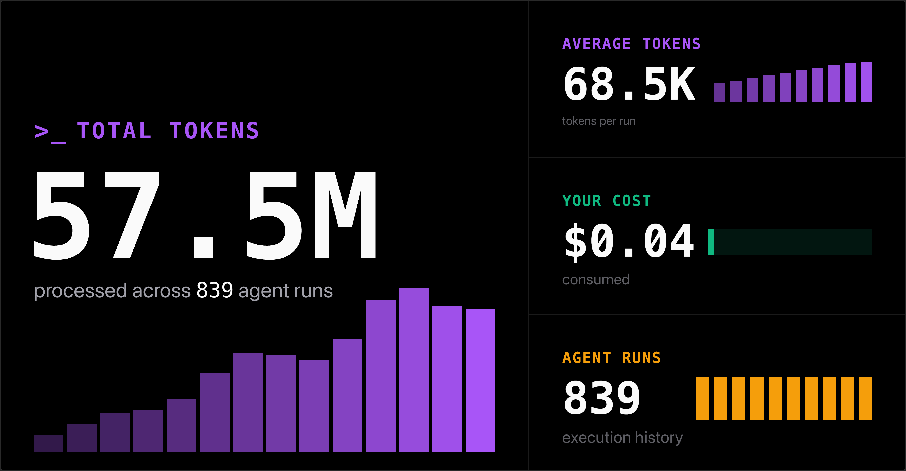

# 鐵人觀察家 Next

2026 iThome 鐵人賽的每日觀察儀表板。靜態站，GitHub Actions 定時抓資料，Cloudflare Pages 免費託管。

🔗 線上站：https://ithome-ironman-observer.happyhacking.ninja/

網站有兩頁：

- **[賽事觀察台](https://ithome-ironman-observer.happyhacking.ninja/)**（首頁）：每支參賽系列一張卡片，看得到進度和人氣
- **[Insights 分析](https://ithome-ironman-observer.happyhacking.ninja/insights/)**：整屆賽事的分析，發文時段、人氣分佈、組別、標題文字等圖表

## 專案起源

本專案源自 [qrtt1/ithome-ironman](https://github.com/qrtt1/ithome-ironman) 的 ITHome 鐵人觀察家（觀戰區），
因原專案已停止維護，故另開新專案接手這個概念，以現代工具鏈（Bun + Astro + GH Actions + Cloudflare Pages）重寫。

## 這個專案的挑戰

這是一個實驗：以 **Command Code 的 $1/月 訂閱**，搭配 **DeepSeek v4 Flash**，
能否真的做出一個有趣、可用的東西？

整個專案（scraper、儀表板、Insights 分析、CI/CD、部署、測試）都由這個組合完成。

### 費用紀錄

第一個核心功能版本的費用：

| 項目 | 數值 |
|---|---|
| Total Tokens | 57.5M |
| 費用 | **$0.04** |
| Runs | 839 |



## 功能

### 賽事觀察台（首頁 `/`）

- 年度切換（年度清單以 `meta.json` 的 `years` 為準）
- 組別篩選 + 我的收藏分頁（以系列 ID 為 key 跨年度共用，只存在本裝置 localStorage）
- 排序：參賽進度、最多觀看、今日發文
- 搜尋（標題／作者／組別／團隊，token AND）
- 卡片狀態標示：DAY n／30 進度條、完賽、已刪文、尚未開賽
- 靜態頁每 60 秒客端重讀年度 JSON；抓取錯誤顯示在 scrapeLog 狀態列
- 深色／淺色主題（預設隨系統，可手動切換）、響應式

### Insights 分析（`/insights/`）

用 ECharts 呈現整屆賽事的資料分析，支援客端切換年度：

- 發文時段直方圖、發文星期、星期 × 小時熱力圖
- 瀏覽數分佈（分桶 + 百分位 CDF）、訂閱數 Top 系列
- 組別分析（系列數／文章數／平均瀏覽／總訂閱）
- 標題關鍵字詞頻、標題長度分佈
- 棄賽進度斷崖、互動轉換率排行、斷更風險名單

分析計算都是純函式（`web/src/lib/insights.ts`），附單元測試；時段和星期用臺北時間（UTC+8）算，不依賴瀏覽器時區。

## 品質

- **SEO：** `robots.txt` + `llms.txt`，方便爬蟲和 AI agent 讀取
- **無障礙：** 循序標題層級、muted／badge 配色符合 WCAG AA 對比
- **效能：** 內嵌 critical CSS、SSR 卡片分批切片、`content-visibility: auto`、分塊渲染、iThome preconnect
- **Lighthouse：** Performance 99、Accessibility 100、Best Practices 100、SEO 100（報告在 `web/public/lighthouse-report.html`）

## 架構與資料

- 沒有後端、沒有資料庫，JSON 就是資料庫。
- 每次抓取輸出 `data/{year}.json` 和 `data/meta.json`，並寫一份每日歷史快照到 `data/history/{year}/{date}.json`。
- 硬限制：近乎零成本，靠 Cloudflare Workers/Pages 免費額度 + GH Actions 公開 repo 免費 runner + 自有網域撐著。
- Non-goals：即時更新（只有每 10 分鐘一次的批次）。

## 本地開發

```bash
bun install
bun run scripts/scrape.ts     # 依 series-manifest 陣列逐年度抓取；全失敗零寫入、exit 1
cd web && bun install && bun run dev
```

## 收藏（Favorites）

卡片右上角星號可收藏系列；「我的收藏」分頁只顯示已收藏系列，沿用排序器。
收藏以系列 ID 為 key 跨年度共用，只存在本裝置瀏覽器（localStorage），不同裝置和瀏覽器之間不互通。

## 測試

```bash
bun test
```

## 部署（已上線，僅供參考）

1. Cloudflare Pages 專案 `ironman-observer-next`（workflow 會自動建立）
2. GitHub repo secrets：`CLOUDFLARE_API_TOKEN`（Pages Edit 權限）、`CLOUDFLARE_ACCOUNT_ID`
3. 自有網域在 Cloudflare dashboard → Pages 專案 → Custom domains 設定
4. Cloudflare Worker `ironman-observer-trigger`（cron `*/10 * * * *`，secrets: `GITHUB_TOKEN`、`GITHUB_REPO`）定時觸發 workflow；也可 `gh workflow run scheduled-update` 手動觸發
