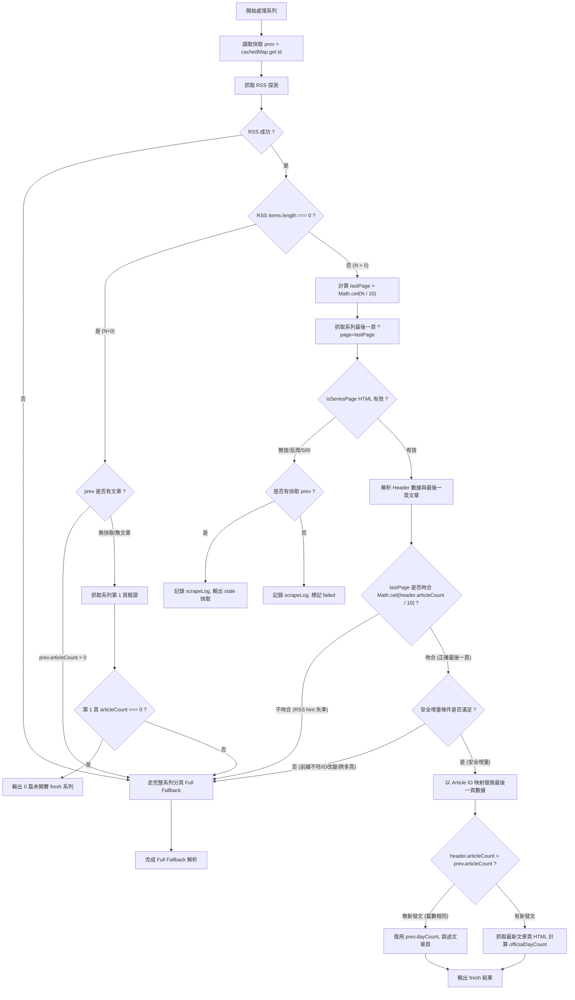

# 爬蟲效能優化與雙模式增量同步設計 (v3 正式修訂版)

## 1. 目標與背景

### 現況痛點
- **CI 耗時長**：原爬蟲採單執行緒序列爬取 263 個系列，每輪需耗費 **3.5 ~ 4.5 分鐘**。
- **請求量過大**：每 10 分鐘全量爬取（報名頁、每個系列 RSS、系列頁 1~3 頁、最新文章頁），單次產生 **1,100 ~ 1,200 個 HTTP 請求**（每日約 15 萬次），對 iThome 伺服器造成不必要的負載。
- **重複抓取舊資料**：98% 以上的系列在 10 分鐘內未發新文，卻持續重複下載歷史分頁與最新文章頁 HTML。
- **iThome 分頁機制特性**：系列頁第 1 頁為最舊 10 篇（Day 0~9），最新文章位於最後一頁（`?page=Math.ceil(N / 10)`）。

### 優化目標與驗收基準 (Acceptance Criteria)
1. **常態請求量指標**：常態增量爬取請求數降至 **520 ~ 580 次**（263 系列 $\times$ 2 請求 + 14 報名頁，相較原先 1,100+ 請求減少 **50% ~ 55% 請求量**，並消除 95%+ 系列的最新文章頁與深層分頁下載）。
2. **CI 耗時目標**：常態每 10 分鐘增量爬蟲時間目標降至 **< 30 秒**（p95 < 45 秒，透過 5 並行 worker 消除序列 I/O 阻塞）。
3. **資料一致性與正確性**：最新文章的閱讀數、按讚數、留言數與最新發文狀態每 10 分鐘即時更新；歷史文章透過 ID 集合與分頁校準，絕不因篇數相同而誤合錯誤文章。
4. **雙模式架構**：日常走高頻「精準最後一頁」增量更新，搭配定時「深度校準（`--full`）」全面刷新歷史文章閱讀數。

---

## 2. 資料權威來源與狀態模型 (Data Authority & State Model)

### 2.1 權威來源階層 (Authority Hierarchy)
1. **文章篇數 (`articleCount`)**：以系列頁標頭 `<span>共 N 篇文章</span>` 為唯一權威值。RSS `items.length` 僅作為定位最後一頁的探測提示（Hint $N_{\text{hint}}$）。
2. **官方參賽天數 (`dayCount`)**：以最新文章頁 `ir-article__days-num` 徽章與系列頁標頭取 `Math.max` 為權威值（官方 streak）。若無新發文且快取有效，直接復用快取 `prev.dayCount`。
3. **更新時間 (`lastUpdated`)**：以 RSS `<lastBuildDate>` 為主要來源；若 RSS 失敗則以最新文章的 `publishedAt` 作為保底。

### 2.2 系列爬取狀態模型 (Series Result Status)
單一系列爬取結果明確定義為三種狀態，禁止將失敗偽裝成成功：

```ts
export type SeriesResult =
  | { status: "fresh"; series: Series }
  | { status: "stale"; series: Series; error: string }
  | { status: "failed"; seriesId: number; error: string };
```

#### 彙整至 `YearData` 與 `scrapeLog` 規則：
- **`fresh`**：放入 `YearData.series`。
- **`stale`**：將快取 `series` 放入 `YearData.series`，同時在 `YearData.scrapeLog` 寫入 `[stale] ${seriesId}: ${error}` 警告。
- **`failed`**：**絕不放入 `YearData.series`**（徹底修正既有程式在無 stats 時製造假 0 篇系列的 bug），在 `YearData.scrapeLog` 寫入 `[failed] ${seriesId}: ${error}`，並累計至回傳的 `failures` 陣列。
- **全部失敗保護**：若 `YearData.series.length === 0`，觸發全失敗防護（終止原子寫入，保留前次資料）。

---

## 3. 雙模式爬蟲體系 (Dual-Mode Architecture)

### 3.1 模式 A：日常增量模式 (Incremental Sync，預設)

#### 核心流程圖


#### 3.1.1 RSS 0 篇保護機制（解決 Blocker #4）
- 當 RSS $N_{\text{hint}} === 0$ 時：
  1. 若 `prev && prev.articleCount > 0`：**嚴禁直接判定為未開賽**（防止 RSS 暫時性空白或端點異常覆蓋有效資料），一律轉入 Full Fallback 進行驗證。
  2. 若 `!prev`（冷啟動）或 `prev.articleCount === 0`：抓取系列第 1 頁 HTML 進行驗證。若第 1 頁標頭確實為 `articleCount === 0`，才輸出 0 篇的未開賽系列；若第 1 頁已有文章，轉入 Full Fallback。

#### 3.1.2 嚴格的安全增量條件（Safety Invariant，解決 Blocker #2、#3）
當且僅當滿足以下**所有**條件時，才執行「最後一頁直接合併」；任何一項不符合一律轉入 **Full Fallback**：
1. **快取完整性**：`prev && prev.articles.length === prev.articleCount && prev.articleCount > 0`。
2. **最後一頁校準**：`lastPage === Math.ceil(header.articleCount / 10)`（證明所抓取的確實是系列真正的最後一頁）。
3. **無大幅跨頁增長**：`lastPage - Math.ceil(prev.articleCount / 10) <= 1`（一次發文未跨超過 1 頁，保證快取已涵蓋前 $\text{lastPage} - 1$ 頁的所有文章）。
4. **可執行前綴驗證**：
   ```ts
   const prefixLength = (lastPage - 1) * 10;
   const cachedPrefixIds = prev.articles.slice(0, prefixLength).map((a) => a.id);
   // 驗證快取前綴長度符合預期
   const isPrefixValid = cachedPrefixIds.length === prefixLength;
   ```
5. **合併後 ID 唯一性**：拼接前段快取文章與本次最後一頁文章後，所有文章 ID 無重複。

#### 3.1.3 文章合併演算法 (`mergeIncrementalArticles`)：
- 對最後一頁文章列表 `lastPageArticles`：
  1. 取出快取中前段歷史文章列表：`const prefixArticles = prev.articles.slice(0, (lastPage - 1) * 10)`。
  2. 建立 ID Identity Map：以 `prefixArticles` 為基礎，將 `lastPageArticles` 依 `id` 進行替換（更新最新瀏覽數、按讚數、留言數）或追加（新文章）。
  3. 最終輸出排序維持現有契約：`articles.sort((a, b) => a.day - b.day)`（保證與現行資料格式 100% 相容）。

---

### 3.2 Full Fallback 完整規範（解決 High #5）
當系列需要 Full Fallback 或處於全量深度校準模式（`--full`）時：
1. **從第 1 頁開始抓取**：
   - 驗證 `isSeriesPage(html)`，若失敗且有快取則標記 `stale`，無快取標記 `failed`。
   - 解析第 1 頁取得權威標頭數據：`headerDayCount`, `articleCount`, `subscriptions`。
   - 收集第 1 頁文章。
2. **分頁遍歷**：
   - 若有下一頁（`nextPage` 且解析文章數 $< \text{articleCount}$），依序抓取後續分頁（`?page=2`, `?page=3`...）。
   - 每個分頁皆需通過 `isSeriesPage` 驗證。若中途分頁抓取失敗：
     - 若有快取 $\rightarrow$ 輸出 `stale` 並記錄錯誤。
     - 若無快取 $\rightarrow$ 輸出 `failed`。
3. **最新文章徽章計算**：
   - 若 `articles.length > 0`，抓取最新文章頁 HTML 呼叫 `officialDayCount`。
   - 若最新文章頁抓取或解析失敗，自動退回第 1 頁標頭天數 `headerDayCount` 保底（此為非致命降級，依然輸出 `fresh`，並在 `scrapeLog` 記錄 warning）。
4. **輸出**：回傳完整組裝的 `fresh` Series 物件。

---

## 4. 頁面有效性驗證 (Page Validity Invariants，解決 Medium #8)

定義明確的布林驗證純函式，防止 Cloudflare Challenge、反爬阻擋或 500/200 空白頁面被誤判：

```ts
export function isSeriesPage(html: string): boolean {
  // 必須包含系列頁核心結構標籤，且能辨識參賽天數/總篇數標頭或文章列表容器
  const hasHeader = /參賽天數\s*\d+\s*天/.test(html) && /共\s*\d+\s*篇文章/.test(html);
  const hasListContainer = html.includes('qa-list__info--ironman') || html.includes('ir-profile-list');
  return hasHeader && hasListContainer;
}

export function isArticlePage(html: string): boolean {
  // 必須包含文章頁核心容器與徽章/問答特徵
  return html.includes('ir-article') || html.includes('qa-markdown');
}
```

---

## 5. 並行架構與請求節流 (Concurrency & Rate Limiting)

### 5.1 Series-Level Concurrency（系列級並行）
- 同一時間最多 **5 個系列** 進入處理流程（Worker Pool Concurrency = 5）。

### 5.2 Request-Level Rate Limiter（全域請求節流）
- 全域限制同時間最多 **5 個 in-flight HTTP requests**。
- 每個 HTTP 請求發送之間加入 **Host-Wide Minimum Interval（20ms）** 平滑流量。
- 重試（Retry）機制：遇到 HTTP 429/5xx 或網路中斷時，透過指數退避（1s, 2s, 4s）重試最多 3 次，重試請求同樣受全域 Rate Limiter 管控。
- 僅對 `!res.ok`（非 2xx 狀態碼）進行重試。

---

## 6. GitHub Actions 工作流程與競態防護 (Workflow & Concurrency Group)

### 6.1 共用 Concurrency Group 防護
`scheduled-update.yml` 與 `deep-calibrate.yml` 統一共用相同的 concurrency group：
```yaml
concurrency:
  group: data-update-main
  cancel-in-progress: false
```
- 保證兩個工作流在 GitHub Actions 佇列中串行執行，絕不並行搶推 main 分支。

### 6.2 標準化 Rebase & Push 協議
```bash
git config user.name "github-actions[bot]"
git config user.email "41898282+github-actions[bot]@users.noreply.github.com"
git add data/ web/public/data/
if git diff --cached --quiet; then
  echo "no data change; skipping commit+build+deploy"
  exit 0
fi
git commit -m "chore: update ironman data $(date -u +%Y-%m-%dT%H:%MZ)"
for attempt in 1 2 3 4 5; do
  if git pull --rebase origin main && git push origin main; then
    exit 0
  fi
  sleep 5
done
echo "push failed after rebase retries" >&2
exit 1
```

---

## 7. 測試與驗證規劃 (Testing Strategy)

### 單元測試覆蓋清單 (`scripts/scrape.test.ts`, `scripts/parse-series.test.ts`)
1. **最後一頁計算與校準**：
   - $N=0 \rightarrow 0$, $N=7 \rightarrow 1$, $N=10 \rightarrow 1$, $N=11 \rightarrow 2$, $N=21 \rightarrow 3$。
2. **Page Boundary Shift（分頁位移合併）**：
   - $9 \rightarrow 10$（同頁增長）
   - $10 \rightarrow 11$（跨入新分頁）
   - $19 \rightarrow 20$（分頁補滿）
   - $20 \rightarrow 21$（跨入第 3 頁）
   - 一次增加超過 10 篇（跨頁躍升，驗證觸發 Full Fallback）
3. **ID 集合一致性檢查**：
   - 快取文章 ID 前綴一致 $\rightarrow$ 允許增量替換最後一頁。
   - 快取文章 ID 重複或前綴不符 $\rightarrow$ 拒絕增量合併，觸發 Full Fallback。
4. **狀態模型與錯誤處理 (`SeriesResult`)**：
   - RSS 失敗但有快取 $\rightarrow$ 走 Full Fallback；若 Full 也失敗 $\rightarrow$ 輸出 `stale` 並記錄 `scrapeLog`。
   - RSS 失敗且無快取 $\rightarrow$ 走 Full Fallback；若 Full 也失敗 $\rightarrow$ 輸出 `failed`，不產生偽造空系列。
   - RSS 回傳 0 篇但快取有文章 $\rightarrow$ 觸發 Full Fallback 驗證，不直接清空。
   - 最後一頁抓取失敗且 RSS 偵測到新文章 $\rightarrow$ 輸出 `stale` 並記錄警告。
   - 頁面驗證：Challenge / 錯誤 HTML $\rightarrow$ `isSeriesPage` 回傳 `false`，觸發異常保護。
5. **等價性驗證 (Equivalence Test)**：
   - 相同網路回傳下，`runIncrementalScrape` 與 `runFullScrape` 產出的 `Series` 物件在資料結構與欄位值上完全等價。
6. **Rate Limiter & Worker Pool 測試**：
   - 驗證同時間 in-flight 請求數不超過限制，且所有任務正常完成。
