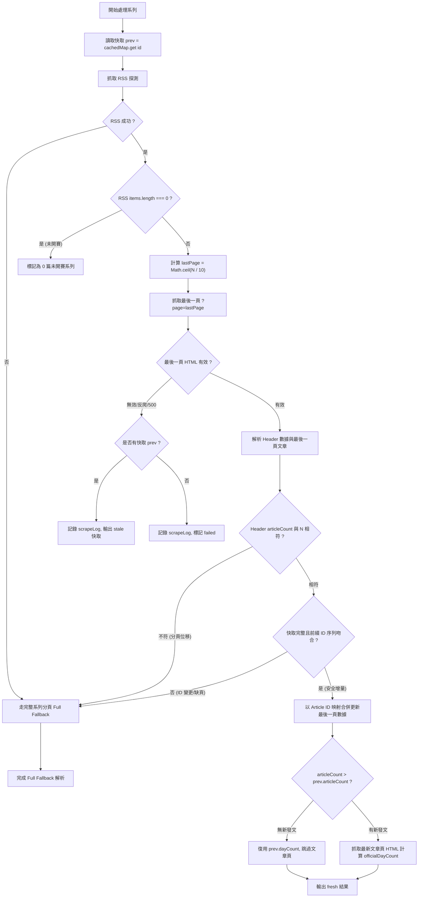

# 爬蟲效能優化與雙模式增量同步設計 (v2 修訂版)

## 1. 目標與背景

### 現況痛點
- **CI 耗時長**：原爬蟲採單執行緒序列爬取 263 個系列，每輪需耗費 **3.5 ~ 4.5 分鐘**。
- **請求量過大**：每 10 分鐘全量爬取（報名頁、每個系列 RSS、系列頁 1~3 頁、最新文章頁），單次產生 **1,100 ~ 1,200 個 HTTP 請求**（每日約 15 萬次），對 iThome 伺服器造成不必要的負載。
- **重複抓取舊資料**：98% 以上的系列在 10 分鐘內未發新文，卻持續重複下載歷史分頁與最新文章頁 HTML。
- **iThome 分頁機制特性**：系列頁第 1 頁為最舊 10 篇（Day 0~9），最新文章位於最後一頁（`?page=Math.ceil(N / 10)`）。

### 優化目標與驗收基準 (Acceptance Criteria)
1. **請求量指標**：常態增量爬取請求數從 1,100+ 降至 **約 280 ~ 350 次**（減少 70%~75% 請求量）。
2. **CI 耗時目標**：常態每 10 分鐘增量爬蟲時間目標降至 **< 30 秒**（p95 < 45 秒，視 GitHub Actions 網路狀況）。
3. **資料一致性與正確性**：最新文章的閱讀數、按讚數、留言數與最新發文狀態每 10 分鐘即時更新；歷史文章透過 ID 集合驗證，絕不因篇數相同而誤合錯誤文章。
4. **雙模式架構**：日常走高頻「精準最後一頁」增量更新，搭配定時「深度校準（`--full`）」全面刷新歷史文章閱讀數。

---

## 2. 資料權威來源與狀態模型 (Data Authority & State Model)

### 2.1 權威來源階層 (Authority Hierarchy)
1. **文章篇數 (`articleCount`)**：以系列頁標頭 `<span>共 N 篇文章</span>` 為權威值。RSS `items.length` 僅作為定位最後一頁的探測提示（Hint）。
2. **官方參賽天數 (`dayCount`)**：以最新文章頁 `ir-article__days-num` 徽章與系列頁標頭取 `Math.max` 為權威值（官方 streak）。若無新發文且快取有效，直接復用快取 `prev.dayCount`。
3. **更新時間 (`lastUpdated`)**：以 RSS `<lastBuildDate>` 為主要來源；若 RSS 失敗則以最新文章的 `publishedAt` 作為保底。

### 2.2 系列爬取狀態模型 (Series Result Status)
為避免「抓取失敗卻靜默回傳舊快取導致資料看起來成功」或「冷啟動失敗回傳空資料」，單一系列爬取結果明確定義為：

```ts
export type SeriesResult =
  | { status: "fresh"; series: Series }
  | { status: "stale"; series: Series; error: string }
  | { status: "failed"; seriesId: number; error: string };
```

- **`fresh`**：本次爬取與合併完全成功，資料為最新。
- **`stale`**：本次抓取新資料失敗（如最後一頁網路逾時或解析異常），但**本地存在有效歷史快取**。輸出快取資料以維持站點運作，同時**必須在 `scrapeLog` 記錄明確警告**（例如 `[stale] 9029: fetch last page failed, using cached data`），讓監控可辨識。
- **`failed`**：抓取失敗且**無歷史快取**（冷啟動失敗）。**絕不產生偽造的 0 篇/0 天空系列**，直接記錄錯誤並排除於最終成功輸出之外（觸發既有的 partial/all-fail 保護）。

---

## 3. 雙模式爬蟲體系 (Dual-Mode Architecture)

### 3.1 模式 A：日常增量模式 (Incremental Sync，預設)

#### 核心流程圖


#### 嚴格的增量合併前置條件（Safety Invariant）：
只有在滿足以下所有條件時，才允許執行增量合併；否則**一律退回該系列的 Full Fallback（全部分頁爬取）**：
1. **快取存在且篇數完整**：`prev && prev.articles.length === prev.articleCount`。
2. **前綴文章 ID 序列完全吻合**：快取中前 $(\text{lastPage} - 1) \times 10$ 篇的文章 ID 順序，必須與快取建立時的歷史紀錄一致。
3. **最後一頁包含交集或最新文章**：最後一頁解析出的文章 ID 必須銜接於快取前綴之後。
4. **Header 篇數與探測一致**：`header.articleCount === rss.items.length`。

#### 文章合併演算法 (`mergeIncrementalArticles`)：
- 採用 **Article ID Identity Map** 進行精準替換：
  1. 取出快取中前段歷史文章列表（第 1 篇至第 $(\text{lastPage} - 1) \times 10$ 篇）。
  2. 對最後一頁解析出的文章列表 `lastPageArticles`：
     - 若 ID 已存在於快取：更新其 `views`, `likes`, `comments`, `title`, `publishedAt`。
     - 若 ID 為新文章：附加至文章清單末端。
  3. 保證文章最終排序依 `publishedAt` 升冪（同時間依 `id` 升冪）。
- **Page Boundary Shift（分頁位移）邊界覆蓋**：
  - $9 \rightarrow 10$ 篇：同在 Page 1，最後一頁仍為 Page 1，`lastPageArticles` 從 9 篇變 10 篇。
  - $10 \rightarrow 11$ 篇：跨入 Page 2，`lastPage = 2`。Page 2 抓到第 11 篇（1 篇），前 10 篇從快取 Page 1 拼接。
  - $19 \rightarrow 20$ 篇：Page 2 補滿 10 篇，前 10 篇從快取 Page 1 拼接。
  - $20 \rightarrow 21$ 篇：跨入 Page 3，`lastPage = 3`。Page 3 抓到第 21 篇（1 篇），前 20 篇從快取 Page 1+2 拼接。
  - **一次新增跨超過 1 頁（例如一次發布 12 篇）**：`lastPage - prev.lastPage > 1` 時，快取缺乏中間頁面，**自動判定不符增量安全條件，直接走 Full Fallback 補齊所有分頁**。

---

### 3.2 模式 B：全量深度校準模式 (Full Calibration Mode，`--full`)
適用於每 2 小時的定時排程或手動觸發。
- 走訪所有系列，從第 1 頁逐頁抓取至最後一頁（`?page=1` $\dots$ `?page=lastPage`）。
- 抓取最新文章頁 HTML 計算官方天數 `officialDayCount`。
- 完整校準歷史所有文章的瀏覽數、按讚數、留言數與訂閱數。

---

## 4. 並行架構與請求節流 (Concurrency & Rate Limiting)

為防止突發請求過高對 iThome 造成壓力，並行與節流明確分為兩個層次：

### 4.1 Series-Level Concurrency（系列級並行）
- 同一時間最多 **5 個系列** 進入處理流程（Worker Pool Concurrency = 5）。

### 4.2 Request-Level Rate Limiter（全域請求節流）
- 全域限制同時間最多 **5 個 in-flight HTTP requests**。
- 每個 HTTP 請求發送之間加入 **Host-Wide Minimum Interval（20ms）** 平滑流量，避免 5 個 worker 同時向 iThome 發送首個 request 產生 burst。
- 重試（Retry）機制：遇到 HTTP 429/5xx 或網路中斷時，透過指數退避（1s, 2s, 4s）重試最多 3 次，重試請求同樣受全域 Rate Limiter 管控。
- 移除原草案中錯誤的「304 重試」敘述，僅對 `!res.ok`（非 2xx 狀態碼）進行重試。

---

## 5. GitHub Actions 工作流程與競態防護 (Workflow & Concurrency Group)

### 5.1 共用 Concurrency Group 防護
為防止 `scheduled-update.yml`（每 10 分鐘）與新增的 `deep-calibrate.yml`（每 2 小時）同時執行導致 git push / rebase 競態失敗或資料覆蓋：

兩個工作流**必須使用相同的 concurrency group**：
```yaml
concurrency:
  group: data-update-main
  cancel-in-progress: false
```
- 當 `deep-calibrate` 正在執行時，下一個 `scheduled-update` 會在佇列中排隊等待，直到前一個工作流完成 push 後才接續執行，絕不並行搶推 main 分支。

### 5.2 標準化 Rebase & Push 協議
所有更新資料的 workflow 皆統一採用以下原子更新與 push 重試協議：
```bash
git config user.name "github-actions[bot]"
git config user.email "41898282+github-actions[bot]@users.noreply.github.com"
git add data/ web/public/data/
if git diff --cached --quiet; then
  echo "no data change; skipping commit+build+deploy"
  exit 0
fi
git commit -m "chore: update ironman data $(date -u +%Y-%m-%dT%H:%MZ)"
for attempt in 1 2 3 4 5; do
  if git pull --rebase origin main && git push origin main; then
    exit 0
  fi
  sleep 5
done
echo "push failed after rebase retries" >&2
exit 1
```

---

## 6. 頁面有效性驗證 (Page Validity Invariants)

為防止反爬頁面、Cloudflare Challenge 或 HTTP 200 空白/錯誤頁面被 parser 誤判為「0 篇文章 / 0 天」：

1. **系列頁 HTML 驗證**：
   - 頁面必須包含系列頁特徵標籤（如 `class="qa-list__info` 或 `class="profile-list` 或 `class="profile-pagination`）。
   - 若 $N > 0$ 但頁面未包含特徵標籤，視為無效頁面（Invalid Page HTML），拋出解析異常以觸發 stale/retry 保護，嚴禁解析為 0 篇。
2. **文章頁 HTML 驗證**：
   - 頁面必須包含 `ir-article` 或 `qa-list` 特徵標籤。若抓取到非預期內容，`parseArticleDay` 回傳 `null`，退回系列頁標頭天數保底。

---

## 7. 測試與驗證規劃 (Testing Strategy)

### 單元測試覆蓋清單 (`scripts/scrape.test.ts`, `scripts/parse-series.test.ts`)
必須新增並通過以下核心測試案例：
1. **最後一頁計算**：$N=0 \rightarrow 0$, $N=7 \rightarrow 1$, $N=10 \rightarrow 1$, $N=11 \rightarrow 2$, $N=21 \rightarrow 3$。
2. **Page Boundary Shift（分頁位移合併）**：
   - $9 \rightarrow 10$（同頁增長）
   - $10 \rightarrow 11$（跨入新分頁）
   - $19 \rightarrow 20$（分頁補滿）
   - $20 \rightarrow 21$（跨入第 3 頁）
   - 一次增加超過 10 篇（跨頁躍升，驗證觸發 Full Fallback）
3. **ID 集合一致性檢查**：
   - 快取文章 ID 前綴一致 $\rightarrow$ 允許增量替換最後一頁。
   - 快取文章 ID 集合改變（文章被刪除/順序變動）$\rightarrow$ 拒絕增量合併，觸發 Full Fallback。
4. **狀態模型與錯誤處理 (`SeriesResult`)**：
   - RSS 失敗但有快取 $\rightarrow$ 走 Full Fallback；若 Full 也失敗 $\rightarrow$ 輸出 `stale` 並記錄 `scrapeLog`。
   - RSS 失敗且無快取 $\rightarrow$ 走 Full Fallback；若 Full 也失敗 $\rightarrow$ 輸出 `failed`，不產生偽造空系列。
   - 最後一頁抓取失敗且 RSS 偵測到新文章 $\rightarrow$ 輸出 `stale` 並記錄警告，不丟失錯誤資訊。
   - 最後一頁為 Challenge / 錯誤 HTML $\rightarrow$ 拋出驗證錯誤，不被解析為 0 篇。
5. **等價性驗證 (Equivalence Test)**：
   - 相同網路回傳下，`runIncrementalScrape` 與 `runFullScrape` 產出的 `Series` 物件在資料結構與欄位值上完全等價。
6. **Rate Limiter & Worker Pool 測試**：
   - 驗證同時間 in-flight 請求數不超過限制，且任務均正常完成。
