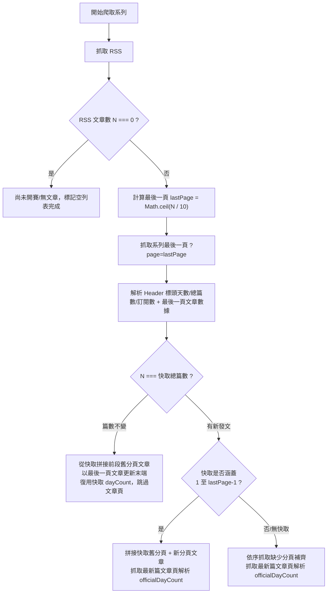

# 爬蟲效能優化與雙模式增量同步設計

## 1. 目標與背景

### 現況痛點
- **CI 耗時長**：原爬蟲採單執行緒序列爬取 263 個系列，每輪需耗費 **3.5 ~ 4.5 分鐘**。
- **請求量過大**：每 10 分鐘爬取全量資料（報名頁、每個系列 RSS、系列頁 1~3 頁、最新文章頁），單次產生 **1,100 ~ 1,200 個 HTTP 請求**（每日約 15 萬次），對 iThome 伺服器造成不必要的負載。
- **重複抓取舊資料**：98% 以上的系列在 10 分鐘內未發新文，卻持續重複下載歷史分頁與最新文章頁 HTML。
- **iThome 分頁機制特性**：系列頁第 1 頁為最舊 10 篇（Day 0~9），最新文章位於最後一頁（`?page=Math.ceil(N / 10)`）。

### 優化目標
1. **縮短 CI 時間**：將常態每 10 分鐘的爬蟲時間降至 **15 ~ 20 秒內**（提升 10x~15x）。
2. **大幅降低請求數**：常態爬取請求數從 1,100+ 降至 **約 280 次**（減少 75% 請求量）。
3. **保持即時性與準確度**：最新文章的閱讀數、按讚數、留言數與最新發文狀態依然每 10 分鐘即時更新。
4. **雙模式架構**：日常走高頻「精準最後一頁」增量更新，搭配每 1~2 小時「深度校準」全面刷新歷史文章閱讀數。

---

## 2. 雙模式爬蟲體系 (Dual-Mode Scraping Architecture)

### 模式 A：日常增量模式 (Incremental Sync，預設)
適用於每 10 分鐘的高頻排程。以本地前次 `data/{year}.json` 作為快取基礎：



#### 增量演算法細節：
1. **讀取快取**：爬蟲啟動時載入 `data/{year}.json`，建立 `cachedSeriesMap = new Map<number, Series>()`。
2. **RSS 探測**：
   - 抓取 `https://ithelp.ithome.com.tw/rss/series/${seriesId}`。
   - 解析取得總篇數 $N = \text{items.length}$ 與 `lastBuildDate`。
3. **定位並抓取最後一頁**：
   - 若 $N = 0$：`articles = []`, `dayCount = 0`, `articleCount = 0`。
   - 若 $N > 0$：計算 $\text{lastPage} = \lceil N / 10 \rceil$。抓取 `seriesUrl + ?page=${lastPage}`。
   - 解析最後一頁：取得 `headerDayCount`、`articleCount`、`subscriptions` 與最後一頁文章列表 `lastPageArticles`（長度 1~10 篇，包含即時的瀏覽數、按讚數、留言數）。
4. **資料合併（Merge）**：
   - 取得快取中該系列資料 `prev = cachedSeriesMap.get(seriesId)`。
   - **情況 1：無新發文（$N === \text{prev.articleCount}$ 且 $\text{prev.articles.length} === N$）**：
     - 保留快取中前 $(\text{lastPage} - 1) \times 10$ 篇歷史文章。
     - 將末端最後一頁的文章替換為 `lastPageArticles`（更新最新 1~10 篇的最新閱讀/讚/留言數）。
     - 官方參賽天數直接復用 `prev.dayCount`（**完全跳過文章頁 HTML 抓取**）。
   - **情況 2：有新發文（$N > \text{prev.articleCount}$）**：
     - 若 $\text{lastPage}$ 與前次相同（例如第 21 篇發布在同一個 page 3）：
       - 前段從快取拼接，末端替換為 `lastPageArticles`。
     - 若跨入新分頁（例如從第 20 篇變第 21 篇，開啟 page 3）：
       - 確保前 1 至 $\text{lastPage}-1$ 頁已在快取中，若無則補抓缺失分頁。
     - 呼叫 `officialDayCount(headerDayCount, lastArticle.url)` 抓取最新文章頁 HTML 解析徽章。
   - **情況 3：冷啟動 / 快取不存在**：
     - 依序抓取第 1 頁至最後一頁補齊所有文章，並呼叫 `officialDayCount`。

---

### 模式 B：全量深度校準模式 (Full Calibration Mode，`--full`)
適用於每 1~2 小時的定時排程或手動觸發。
- 走訪所有系列，從第 1 頁逐頁抓取至最後一頁（`?page=1` $\dots$ `?page=lastPage`）。
- 抓取最新文章頁 HTML 計算官方天數 `officialDayCount`。
- 完整校準歷史所有文章的瀏覽數、按讚數、留言數與訂閱數。

---

## 3. 並行架構與請求節流 (Concurrency & Rate Limiting)

為了在大幅縮短執行時間的同時，避免短時間並發過高對 iThome 造成瞬時突發負載：

### Worker Pool 並行控制
- 實作輕量級並行限制器 `pMap` / Worker Pool（並行度 `concurrency = 5`）。
- 同一時間最多 5 個系列同時進行抓取與解析。

### Pacing 節流與重試
- 每個 worker 在處理完一個系列後，維持 50ms 的平滑間隔。
- 維持現有 `fetchHtml` 指數退避重試（遇到非 200/304 狀態時，等待 1s, 2s, 4s 後重試最多 3 次）。
- **效能預估**：
  - 263 個系列 / 5 個 worker $\approx$ 53 輪。
  - 每系列 2 個請求並行，每輪耗時 $\approx 250\text{ms}$。
  - 總執行時間：$53 \times 0.25\text{s} + \text{signup list} \approx \mathbf{15 \sim 18 \text{ 秒}}$。

---

## 4. CLI 介面與工作流程 (CLI & Workflows)

### 1. CLI 參數
```bash
# 預設：增量模式（讀取 data/{year}.json 快取）
bun run scripts/scrape.ts

# 全量校準模式：強制深爬所有分頁與文章頁
bun run scripts/scrape.ts --full
```

### 2. GitHub Actions 工作流程配置

1. **`scheduled-update.yml`（現有工作流，維持 10 分鐘一次）**：
   - 執行命令：`bun run scripts/scrape.ts`
   - 每次執行時間約 15~20 秒，若 `data/` 與 `web/public/data/` 有變化則 commit + build + deploy。
2. **`deep-calibrate.yml`（新增工作流，每 2 小時一次 / 可手動觸發）**：
   - 觸發條件：`schedule: - cron: "15 */2 * * *"` + `workflow_dispatch`。
   - 執行命令：`bun run scripts/scrape.ts --full`
   - 若數據有變動則 commit + build + deploy，確保歷史文章互動數據校準。

---

## 5. 錯誤處理與退回機制 (Fault Tolerance & Fallbacks)

1. **快取毀損或遺失容錯**：
   - 若 `data/{year}.json` 讀取失敗、JSON 格式損壞、或特定系列在快取中不存在，自動退回該系列的「全量抓取」模式，絕不崩潰。
2. **RSS 抓取失敗容錯**：
   - 若單一系列 RSS 抓取失敗（404/500/逾時），退回直接從系列第 1 頁開始爬取（相容舊版行為），並記錄錯誤至 `scrapeLog`。
3. **最後一頁抓取失敗容錯**：
   - 若增量模式抓取最後一頁失敗，退回快取資料（若存在），避免單一網路閃斷覆蓋整篇系列。
4. **兩階段原子寫入保證**：
   - 完整保留現有的 `stageWrites`（`.tmp` 檔案暫存）與 `commitWrites`（原子更名 + 失敗 rollback 機制），保證任何中途異常不會產生破碎資料。

---

## 6. 測試與驗證規劃 (Testing Strategy)

### 單元測試 (`scripts/scrape.test.ts`, `scripts/parse-series.test.ts`)
1. **最後一頁計算與定位測試**：
   - $N = 0 \rightarrow \text{lastPage} = 0$
   - $N = 7 \rightarrow \text{lastPage} = 1$
   - $N = 10 \rightarrow \text{lastPage} = 1$
   - $N = 21 \rightarrow \text{lastPage} = 3$
2. **增量文章合併邏輯測試 (`mergeIncrementalArticles`)**：
   - 篇數不變：歷史文章保持、最後一頁數據更新。
   - 篇數增加（同頁）：新增文章正常附加、最後一頁數據更新。
   - 篇數增加（跨頁）：新分頁文章正常附加。
   - 無快取冷啟動：完整全量抓取。
3. **並行 Worker Pool 測試**：
   - 驗證並行度限制在 5，且所有任務正常完成與彙整。
4. **CLI 參數測試 (`scripts/scrape-cli.test.ts`)**：
   - 驗證 `--full` 參數正確觸發全量深爬模式。
   - 驗證預設模式正確傳入快取資料。
